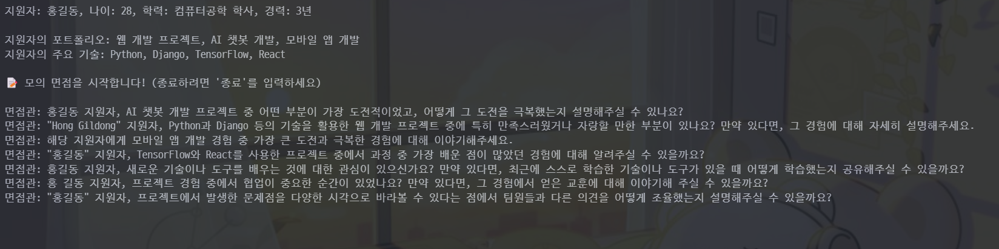

# 🤖 AI 면접 챗봇 🚀

---

## ✨ 프로젝트 소개

AI 면접 챗봇은 OpenAI의 GPT-3.5-turbo 모델을 활용하여 실제 면접과 유사한 경험을 제공하는 파이썬 스크립트입니다. 이 챗봇은 지원자의 정보를 기반으로 맞춤형 질문을 생성하여, 면접 준비에 효과적으로 대비할 수 있도록 돕습니다. 🎯

### 🌟 주요 기능

*   **맞춤형 질문 생성**: 지원자의 경력, 기술 스택, 포트폴리오에 맞춰 차별화된 질문을 생성합니다.
*   **실시간 상호작용**: 챗봇과의 대화를 통해 실제 면접 환경을 시뮬레이션합니다.
*   **지속적인 학습**: 이전 질문과 답변을 기억하여, 더욱 심층적인 질문을 던집니다.

---

## 🛠️ 설치 방법

1.  **저장소 클론**:
    ```
    git clone https://github.com/Leegwangwoon/AI-Interview-Chatbot.git
    ```

2.  **필요 패키지 설치**:
    ```
    pip install openai python-dotenv
    ```

3.  **.env 파일 설정**:
    OpenAI API 키를 `.env` 파일에 추가합니다. (API 키는 [OpenAI 플랫폼](https://platform.openai.com/playground/prompts)에서 발급받을 수 있습니다.)

    ```
    OPENAI_API_KEY=YOUR_API_KEY_HERE
    ```

4.  **코드 실행**:

    ```
    python interview_simulator.py
    ```

---

## 🖼️ 구현 화면



\_(실행 화면 이미지 예시입니다. 실제 실행 결과 이미지를 넣어주세요!)\_

---

## 💡 사용 팁

*   면접 연습 전에 지원자 정보를 꼼꼼하게 입력하면 구체적인 질문 생성에 도움 됩니다.
*   챗봇의 질문에 솔직하고 구체적으로 답변하여, 실제 면접 상황처럼 연습해봅시다!!
*   다양한 질문과 답변을 시도하여, 예상치 못한 질문에 대한 대비력을 키워 봅시다!!!!

---
